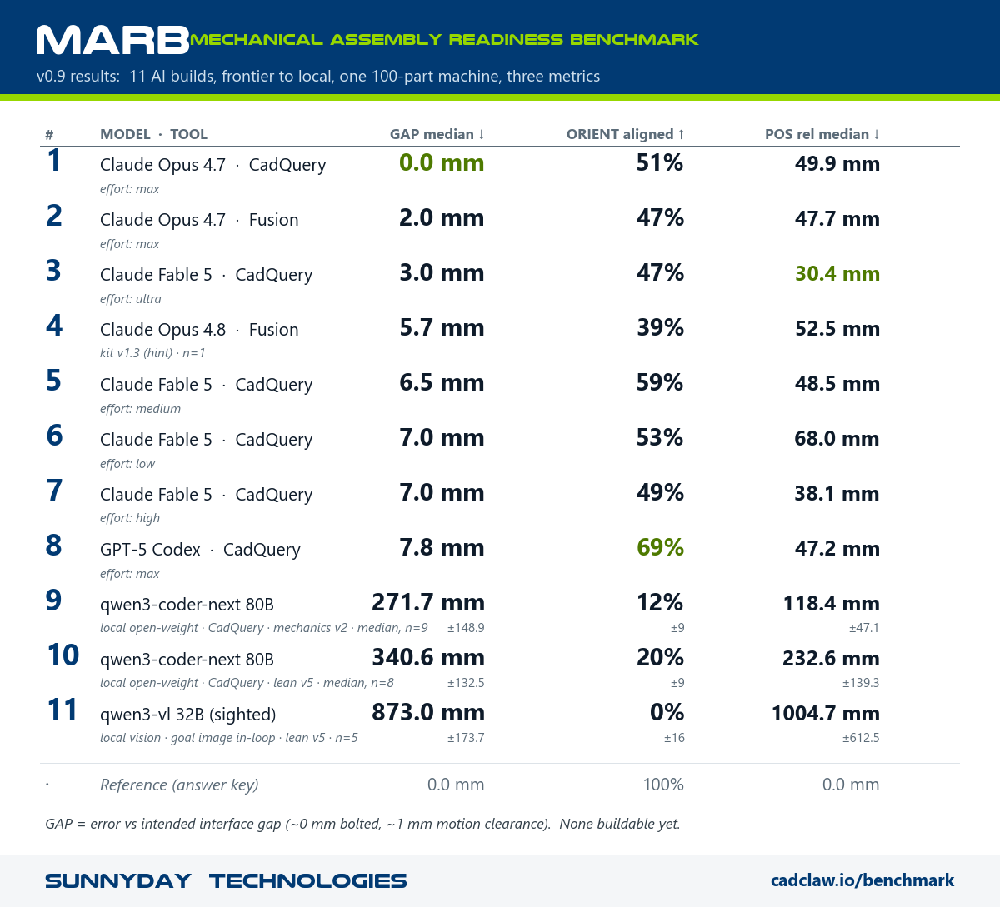

# MARB — Mechanical Assembly Readiness Benchmark

MARB is a tool-independent, automatically graded benchmark. It measures how
correctly AI-assisted CAD places the parts of a real machine: the right
position, the right orientation, and the right gap at every interface. The model
is given only the authored parts and a single goal image. It receives no build
steps. Any tool or agent can be tested, including Autodesk Fusion, CadQuery, or
a custom agent.

MARB is developed by **Sunnyday Technologies**. It runs on the open-source
[CADCLAW](https://github.com/sunnyday-technologies/CADCLAW) verification engine.
Project home: [cadclaw.io/benchmark](https://cadclaw.io/benchmark).

---

## What it grades (v0.9)

MARB grades three positional metrics against the answer key, under a fixed,
tight standard (see [`spec/MARB_SCORING.md`](spec/MARB_SCORING.md)):

- **GAP** is the error between the actual and intended interface gap. The
  intended gap is about 0 mm where parts bolt together and about 1 to 2 mm
  where parts move. GAP is reported as a median in millimeters. It is the
  primary functional score.
- **ORIENT** is the share of orientation-gradeable (asymmetric) parts placed in
  the correct rotation, reported as a percent aligned. Rotationally symmetric
  parts are skipped.
- **POS** is the position error of each part versus the answer key after a
  best-fit rigid alignment. It is reported as a median in millimeters, both
  absolute (raw exported frame) and relative (neighbor-relative).

Buildability stays on as a secondary gate.

## Results — the board so far

Every run builds the same machine of about 100 parts from the same blind kit
and is graded identically. The board now spans frontier hosted models down to
the local open-weight anchor, ranked by GAP median.

| # | Model · tool | Effort / cohort | GAP median | ORIENT aligned | POS relative median |
|---|---|---|---|---|---|
| 1 | Claude Opus 4.7 · CadQuery | max | **0.0 mm** | 51% | 49.9 mm |
| 2 | Claude Opus 4.7 · Fusion | max | 2.0 mm | 47% | 47.7 mm |
| 3 | Claude Fable 5 · CadQuery | ultra (multi-agent) | 3.0 mm | 47% | **30.4 mm** |
| 4 | Claude Opus 4.8 · Fusion | v1.3 (hint), n=1 | 5.7 mm | 39% | 52.5 mm |
| 5 | Claude Fable 5 · CadQuery | medium | 6.5 mm | 59% | 48.5 mm |
| 6 | Claude Fable 5 · CadQuery | low | 7.0 mm | 53% | 68.0 mm |
| 7 | Claude Fable 5 · CadQuery | high | 7.0 mm | 49% | 38.1 mm |
| 8 | GPT-5 Codex · CadQuery | max | 7.8 mm | **69%** | 47.2 mm |
| 9 | Local · qwen3-coder-next 80B (n=9) | mechanics v2 | 272 ± 149 mm | 12% | 118 ± 47 mm |
| 10 | Local · qwen3-coder-next 80B (n=8) | lean v5 | 341 ± 133 mm | 20% | 233 ± 139 mm |
| 11 | Sighted · qwen3-vl 32B (n=5) | lean v5 + goal image | 873 ± 174 mm | 0% | 1005 ± 613 mm |
| · | *Reference (answer key)* | | *0.0 mm* | *100%* | *0.0 mm* |



None of these results is buildable yet. The target is a machine that could be
bolted together as is, and that is what the metrics measure. Notable in the
Claude Fable 5 effort sweep: effort does not scale monotonically — medium beat
both low and high on GAP and ORIENT — but the ultra run (multi-agent
adversarial audit + fix loop) cut GAP to 3.0 mm and set the board-best
relative position (30.4 mm), at roughly double the wall-clock of the other
Fable runs. The Claude Opus 4.8 Fusion run (rank 4) lands the frame less
precisely than Opus 4.7 did, but it ran on the hint-equipped v1.3 kit while the
Opus 4.7 Fusion run used the no-hint v1.1 kit, so the two are different cohorts,
not a clean head-to-head. Frontier write-ups:
[`results/comparison_claude_tracks.md`](results/comparison_claude_tracks.md) and
[`results/prompt_framework_findings.md`](results/prompt_framework_findings.md).

## The local-anchor floor

The frontier track shows the current top end. The local-anchor floor (rows 9
to 11 above) shows the current low end: the models a shop with no internet and
no hosted API could run on its own hardware. The text anchor is an 80B
open-weight coder, `qwen3-coder-next`, building the same machine blind; its
cells now aggregate ten seeds each (9/10 and 8/10 produced a loadable STEP —
the n=5 "5/5 buildable" rate did not survive more seeds, which is the point of
seeds). The **sighted cell** gives a 32B vision model (`qwen3-vl`) the goal
image in-loop — and it does *worse* than the blind text model on every metric
(873 mm GAP, 0% orientation, ~15 parts placed of ~101): at this scale, vision
tokens crowd out geometry. A 12-turn variant (n=2, preliminary) improves
placement accuracy but not part count; a second vision model (Nemotron 3 Nano
Omni) produced 0/5 loadable exports. Full sighted grades:
[`results/marb_sighted_grades.json`](results/marb_sighted_grades.json).

The text-anchor model reliably imports the right parts, but it places them loosely rather
than as a jointed frame. Parts land 100 to 400 mm off on a 2000 mm machine. The
native gates agree: the part mix is wrong, and 20 to 28 part-pairs clip, while
nothing floats free. One CadQuery export-mechanic fix raised the buildable rate
from 1 of 5 to 5 of 5. Adding more prompt scaffolding made the results worse,
not better. A larger token budget did not improve quality. Write-up:
[`results/local_anchor_study.md`](results/local_anchor_study.md). Figure:
[`results/figures/marb_local_3panel.png`](results/figures/marb_local_3panel.png).

## Quickstart

The grader scores a run against the **answer key** (the reference STEP + the
placement spec). The answer key is gated to prevent training-data contamination
(not for secrecy), so fetch it once and drop it under `tasks/m3_crete/`:

- Request access: https://huggingface.co/datasets/SunnydayTech/marb-m3-crete-answer-key
- Place `m3_reference_round1.step` and `m3_reference_assembly.yaml` in `tasks/m3_crete/`.

The benchmark input (kits, brief, scoring spec) is open and needs no gate:
https://huggingface.co/datasets/SunnydayTech/marb-m3-crete

```bash
# Install the cadclaw grading engine and STEP I/O (0.9.0+ is on PyPI). See requirements.txt.
pip install "cadclaw>=0.9.0"
pip install -r requirements.txt

# Grade the reference against itself (writes a fresh grades file).
python grader/marb_grade_all.py --json results/marb_grades_local.json

# Grade a set of runs via the run registry (median, mean, and std per cell).
python grader/marb_grade_all.py --manifest results/marb_runs.json \
    --json results/marb_v0_9_stats.json
```

A single run can be graded directly:

```bash
python grader/marb_pose_metric.py  --ref tasks/m3_crete/m3_reference_round1.step --run your_export.step
python grader/marb_gap_metric.py   --ref tasks/m3_crete/m3_reference_round1.step --run your_export.step
python grader/marb_orient_metric.py --ref tasks/m3_crete/m3_reference_round1.step --run your_export.step
```

## Run a model against it

1. Give the model a **blind kit** from [`kits/`](kits/). A kit holds the
   authored parts, the goal image, and the task brief, with no answer key.
   Versions are tracked in [`kits/KIT_VERSIONS.md`](kits/KIT_VERSIONS.md).
2. Run the model in a sealed, memoryless context so the answer key cannot leak.
   Use a neutral folder with cross-session memory turned off. See the blind-run
   protocol in the spec.
3. Fetch the gated answer key (see Quickstart), then hand the exported STEP file
   back and grade it with the commands above.

## Layout

```
spec/MARB_SCORING.md     the canonical, versioned scoring method
grader/                  the metrics and figure builders (depend on the cadclaw package)
tasks/m3_crete/          where the gated answer key (STEP + spec) goes; fetch from the HF dataset (see Quickstart)
kits/                    versioned blind kits handed to the driver, plus KIT_VERSIONS.md
prompts/                 the frozen task brief, per-backend driver stubs, and generator
results/                 grades, run registry, findings, and figures
benchmark.yaml           gate weights for the secondary buildability score
```

## Versioning and comparability

Results are comparable only within a single **kit cohort** and a fixed scoring
version. Each run records its kit version, its model and tool versions, and the
client environment (see [`results/marb_runs.json`](results/marb_runs.json)). Do
not pool runs across kit versions without noting it.

## Citation

If you use MARB in published research or derivative work, please cite it (see
[`CITATION.cff`](CITATION.cff)).

## License

The MARB code is released under the MIT license. Copyright (c) 2026 Sunnyday
Technologies. See [`LICENSE`](LICENSE). The CAD parts bundled in the blind kits
are licensed separately. OpenBuilds-derived parts are under CC BY-SA 4.0, and
Sunnyday-authored parts are under the repository MIT license. See
[`kits/LICENSE.md`](kits/LICENSE.md). Product and company names used to identify
the tools tested are trademarks of their respective owners.
