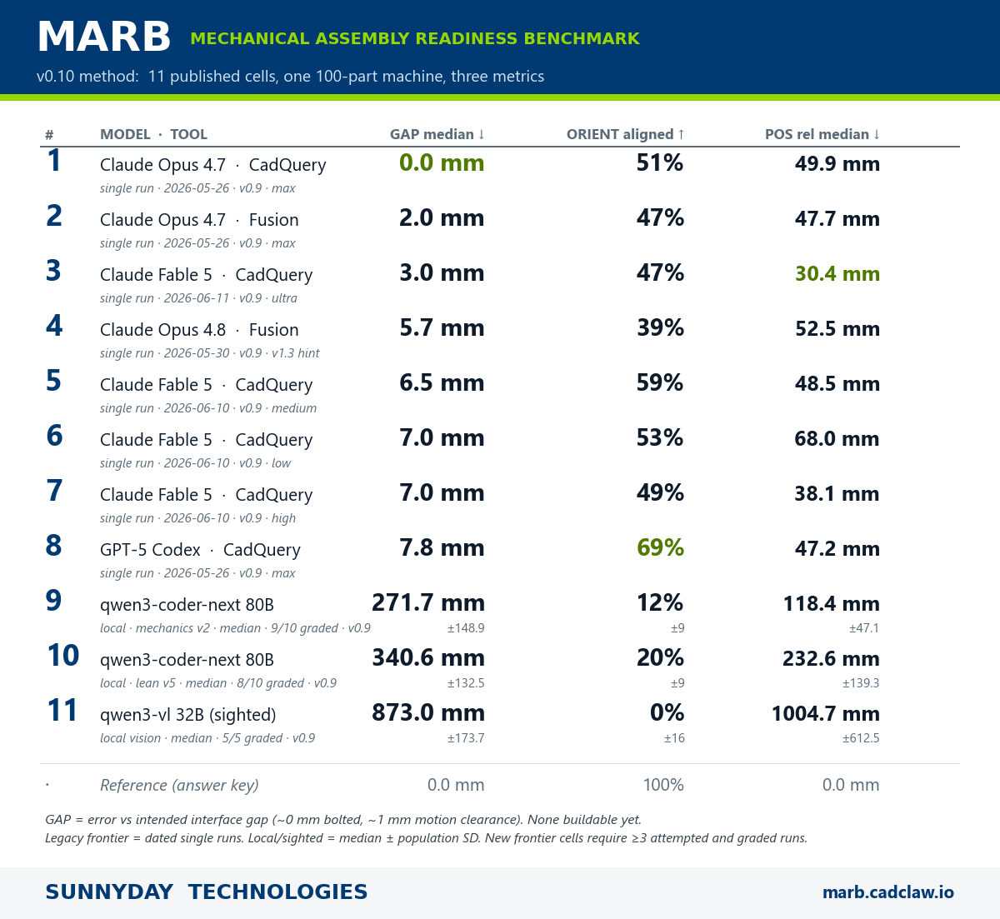

# MARB — Mechanical Assembly Readiness Benchmark

MARB is a tool-independent, automatically graded benchmark. It measures how
correctly AI-assisted CAD places the parts of a real machine: the right
position, the right orientation, and the right gap at every interface. The model
is given only the authored parts and a set of goal renders — a 3/4 isometric
overview plus front, top, and side views, which show how the parts relate in
space and reveal components a single view would hide. It receives no build
steps. Any tool or agent can be tested, including Autodesk Fusion, CadQuery, or
a custom agent.

MARB is developed by **Sunnyday Technologies**. It runs on the open-source
[CADCLAW](https://github.com/sunnyday-technologies/CADCLAW) assembly and
verification framework; MARB's graders import CADCLAW's gates.
Project home: [marb.cadclaw.io](https://marb.cadclaw.io).

---

## What it grades (v0.12)

MARB grades three positional metrics against the answer key, under a fixed,
tight standard (see [`spec/MARB_SCORING.md`](spec/MARB_SCORING.md)):

- **GAP** is the error between the actual and intended interface gap. The
  intended gap is about 0 mm where parts bolt together and about 1 to 2 mm
  where parts move. GAP is reported as a median in millimeters. It is the
  primary functional score.
- **ORIENT** is the share of parts whose rotation can be graded by the current
  axis-aligned bounding-box extent proxy and that are placed in the correct
  rotation, reported as a percent aligned. Parts with two near-equal extents
  are skipped because this proxy cannot distinguish their rotation.
- **POS** is the position error of each part versus the answer key after a
  best-fit rigid alignment. It is reported as a median in millimeters, both
  absolute (raw exported frame) and relative (neighbor-relative).

Buildability stays on as a secondary gate.

The current M3-CRETE grade uses one resolver-built geometric answer. It already
treats same-label repeated parts as interchangeable during matching, and its
ORIENT proxy skips parts when near-equal bounding-box extents make rotation
unobservable to that proxy. The v0.10 current-kit audit found no independently
validated second complete answer class, so no alternate handed layout or
interface topology is currently declared equivalent. Such submissions remain
outside the declared classes and may be penalized; MARB has not established
whether they are functionally acceptable. The exact limitation and the
whole-class rule for future alternatives are published in
[`spec/MARB_SCORING.md`](spec/MARB_SCORING.md#51-acceptable-solution-classes-and-current-limitation).

### L2-RESOLVE definition (unmeasured)

MARB v0.11 freezes an L2 change-loop task without publishing an L2 result. In
task revision `top-spreader-x+200-r1`, the same driver that produced the initial
M3-CRETE editable build must move the existing five-instance top-center-
spreader subassembly +200.0 mm along global X and preserve the other 95
instances. The normative request and machine-readable contract are under
[`tasks/m3_crete_l2_resolve/`](tasks/m3_crete_l2_resolve/).

The task is `defined_unmeasured`. Its task-specific private resolver key is
locally authored and validated, but no gated dataset revision has been uploaded.
The registry has zero L2 runs, and a qualifying same-driver editable before/after
source pair plus at least three genuine gradeable attempts are not yet available.
There is therefore no L2 board row or score, no historical L1 rescore, and no
change to the currently scored L0/L1 ladder. The exact evidence boundary is recorded in
[`results/evidence/l2_resolve/v0.11/blocker.json`](results/evidence/l2_resolve/v0.11/blocker.json).

### L4-ECO definition (unmeasured)

MARB v0.12 freezes one engineering-change task without publishing an L4
result. Revision `second-top-cross-spreader-midright-r1` adds one existing
authored 20x40x1000 rail as a second top-frame cross-spreader at the global-X
midpoint between the center spreader and top-right side rail, while preserving
all 100 baseline authored instances. The normative request and machine-readable
contract are under [`tasks/m3_crete_l4_eco/`](tasks/m3_crete_l4_eco/).

The fail-closed public invariant gate uses audited CADCLAW 0.10.0 geometry
snapshots and deterministic maximum matching to check the one-shape delta,
the added rail's rounded AABB-dimension signature, requested axis orientation,
and unchanged AABB poses. Its report is aggregate-only. CADCLAW renderable-
shape counts are kept distinct from the task's authored 100-to-101 instance
contract. A separate private task-local reference grade is required for the
requested midpoint/top-flush placement. A graded result must bind that private
aggregate report to an immutable gated-dataset readback; copied public `pass`
metadata is not accepted.

The private key is locally authored and validated, but it has not been uploaded
and read back through a gated dataset revision. There are zero registered L4
runs, the key-authoring/team session is non-blind, and no qualifying three-run
cohort exists. L4 therefore remains
`defined_unmeasured`: no score, board row, historical rescore, or change to the
currently scored L0/L1 ladder. The evidence boundary is
[`results/evidence/l4_eco/v0.12/blocker.json`](results/evidence/l4_eco/v0.12/blocker.json).

### H2 cohort execution status

MARB includes a deterministic H2a planner and a separate H2b executor for one
explicitly authorized `L1-ASSEMBLE`, `L2-RESOLVE`, or `L4-ECO` slot. H2b is
currently restricted to text-only, local-no-charge provider sessions and a
digest-pinned, networkless CadQuery container. Authorization binds the exact
plan, slot, committed implementation and frozen inputs, provider/model/settings,
and container runtime before provider access. Authorization schema v2 also binds
an absolute normalized Git executable path and the SHA-256 digest of its raw
bytes; schema validation confirms those declared bindings. Execution preflight,
not `validate-authorization`, verifies the actual host path chain and file
digest. For every Git process creation, H2b locks the host path chain with
Windows handles and reverifies the file digest while those handles remain held
across the hash-to-spawn interval, closing executable replacement. It uses only
the authenticated path as `argv[0]`, never a bare
executable resolved through the working directory or `PATH`. It rejects
symlink/reparse path chains, invokes Git with `--no-replace-objects` and
`GIT_NO_REPLACE_OBJECTS=1`, supplies only the exact resolved repository as the
per-command `safe.directory` value (never `*`), and fails closed on timeout or
bounded-stdout overflow. L2/L4 preserve one continuous
baseline-to-change session and freeze baseline STEP plus editable source before
the change request is revealed. The only accepted prompt variant is
`frozen-core`; from each frozen driver brief, only the payload between its exact
`` `=== BEGIN ===` `` / `` `=== END ===` `` marker lines is sent as the provider
user message, excluding the preamble and grader suffix.

The plan's `cell_label` and `model.name` are operator-supplied display labels,
not model-identity evidence. Any later publishable identity must use the exact
authorized `model.id` confirmed by the provider response; H2b defines no alias
policy.

Authorization and all execution limits apply to one logical slot and its one
retained attempt, not to a cohort-wide campaign budget. That includes
`max_cost_usd`, which current local-no-charge policy requires to be null. An
N=3 or N=9 campaign requires a separately approved aggregate ledger with
concurrency control before provider calls; H2b does not implement that ledger.
The permanent `.slot-claims` record prevents duplicate claims only among
executors sharing one checkout. Because `runs/` is ignored and checkout-local,
cross-clone and cross-host uniqueness remains an operator/campaign-ledger and
later registry/publication validation responsibility; this is not a global
lock. The retained `execution_modality` attestation is deliberately limited and
negative: provider input is text, there is no native image-view tool, staged
image bytes can be inspected through model-authored Python, and
`vision_attested` is `false`.

Inside the sandbox, the complete staged input tree is read-only at
`/marb-input` (with geometry also at `/workspace/kit`); editable-source evidence
captures all safe authored workspace files except the canonical STEP and
rejects reserved manifest/status identities. Content-bound inventories before
and after capture make additions, removals, replacements, or mutations fail
closed before the ZIP target is created.

The H2b CLI provides no-call `authorization-template`, `seal-authorization`,
and `validate-authorization` steps before the separately confirmed `execute`
command. Their status output avoids absolute local paths; retained execution
failures are structured and preserve a repository-relative run path. In the
retained `output_contract`, `executor_owned_outputs` identifies paths reserved
and bound to the executor, not files proven to exist. Only captured artifact
records prove production, so failed or partial runs never describe a missing
path as produced output.

The executor creates retained, UUID-backed evidence but does not grade, register
a run, edit the board, rebuild the site, publish, or deploy. L4's planned public
invariant and requested-change reports are grader-owned deferred outputs; an
executor result is `completed_ungraded`. No new benchmark run or score is
claimed by this release. The current container implementation is restricted to
Windows Docker Desktop host semantics, and no image/host pair is qualified until
a real no-provider/no-network manual smoke succeeds after an operator approves
an immutable RepoDigest. See
[`harness/H2B_EXECUTOR.md`](harness/H2B_EXECUTOR.md).

## Results — the board so far

Every board row targets the same machine of about 100 parts, but the runs span
versioned blind-kit and harness cohorts. Results are graded with the scoring
version shown per row and are comparable only within a matching kit, prompt,
tool, and harness cohort. The board spans frontier hosted models down to the
local open-weight anchor, ranked by GAP median.

Rows 1–8 are the legacy frontier observations: one run per cell, dated below
and retained under their original v0.9 scoring tag. Rows 9–11 are repeat-run
cells reported as median ± population standard deviation, with attempted and
graded counts kept separate. Effective 2026-08-28, every new frontier cell must
register at least three independent attempts and three gradeable outputs before
publication; attempts or retries inside one session do not count as new runs.
Post-policy cells also register a unique run ID, distinct run-log path and
SHA-256 digest per attempt, and a STEP digest for every graded output; the grade
source must identify the exact graded run IDs.

| # | Model · tool | Effort / cohort | GAP median | ORIENT aligned | POS relative median |
|---|---|---|---|---|---|
| 1 | Claude Opus 4.7 · CadQuery | max · single run · 2026-05-26 · v0.9 | **0.0 mm** | 51% | 49.9 mm |
| 2 | Claude Opus 4.7 · Fusion | max · single run · 2026-05-26 · v0.9 | 2.0 mm | 47% | 47.7 mm |
| 3 | Claude Fable 5 · CadQuery | ultra (multi-agent) · single run · 2026-06-11 · v0.9 | 3.0 mm | 47% | **30.4 mm** |
| 4 | Claude Opus 4.8 · Fusion | v1.3 (hint) · single run · 2026-05-30 · v0.9 | 5.7 mm | 39% | 52.5 mm |
| 5 | Claude Fable 5 · CadQuery | medium · single run · 2026-06-10 · v0.9 | 6.5 mm | 59% | 48.5 mm |
| 6 | Claude Fable 5 · CadQuery | low · single run · 2026-06-10 · v0.9 | 7.0 mm | 53% | 68.0 mm |
| 7 | Claude Fable 5 · CadQuery | high · single run · 2026-06-10 · v0.9 | 7.0 mm | 49% | 38.1 mm |
| 8 | GPT-5 Codex · CadQuery | max · single run · 2026-05-26 · v0.9 | 7.8 mm | **69%** | 47.2 mm |
| 9 | Local · qwen3-coder-next 80B | mechanics v2 · median · 9/10 graded · v0.9 | 272 ± 149 mm | 12 ± 9% | 118 ± 47 mm |
| 10 | Local · qwen3-coder-next 80B | lean v5 · median · 8/10 graded · v0.9 | 341 ± 133 mm | 20 ± 9% | 233 ± 139 mm |
| 11 | Sighted · qwen3-vl 32B | lean v5 + goal image · median · 5/5 graded · v0.9 | 873 ± 174 mm | 0 ± 16% | 1005 ± 613 mm |
| · | *Reference (answer key)* | | *0.0 mm* | *100%* | *0.0 mm* |



None of these results meets the target values across all configured digital
inventory, interference, and floating-part gates and GAP, ORIENT, and POS
metrics. Those artifact checks do not establish that a physical machine can be
fabricated or bolted together. In the dated single-run Claude Fable 5 cells,
the recorded metrics are non-monotonic
across effort labels: medium recorded lower GAP and higher ORIENT than low and
high, while the ultra multi-agent harness recorded 3.0 mm GAP and 30.4 mm
relative POS at roughly double the wall-clock. These confounded single runs do
not isolate an effort or harness effect. The Claude Opus 4.8 Fusion run (rank 4) lands the frame less
precisely than Opus 4.7 did, but it ran on the hint-equipped v1.3 kit while the
Opus 4.7 Fusion run used the no-hint v1.1 kit, so the two are different cohorts,
not a clean head-to-head. Frontier write-ups:
[`results/comparison_claude_tracks.md`](results/comparison_claude_tracks.md) and
[`results/prompt_framework_findings.md`](results/prompt_framework_findings.md).

## The local-anchor floor

The included frontier track records the hosted-model cells; the local-anchor
rows 9 to 11 provide a separate, dated open-weight comparison for hardware that
can run without a hosted API. The text anchor is an 80B
open-weight coder, `qwen3-coder-next`, building the same machine blind; its
cells now aggregate ten seeds each (9/10 and 8/10 produced a loadable STEP —
the initial n=5 "5/5 loadable-export" rate changed when more seeds were added,
which illustrates why repeat runs matter). The **sighted cell** gives a 32B vision model (`qwen3-vl`) the goal
image in-loop — and it does *worse* than the blind text model on every metric
(873 mm GAP, 0% orientation, ~15 parts placed of ~101). That pattern is
consistent with the added vision context competing with geometry work, but
this confounded cohort does not isolate the cause. A 12-turn variant (n=2, preliminary) improves
placement accuracy but not part count; a second vision model (Nemotron 3 Nano
Omni) produced 0/5 loadable exports. Full sighted grades:
[`results/marb_sighted_grades.json`](results/marb_sighted_grades.json).

The text-anchor model reliably imports the right parts, but it places them loosely rather
than as a jointed frame. Parts land 100 to 400 mm off on a 2000 mm machine. The
native gates agree: the part mix is wrong, and 20 to 28 part-pairs clip, while
nothing floats free. In the named cohorts, one CadQuery export-mechanic change
raised the loadable-export rate from 1 of 5 to 5 of 5; added prompt scaffolding
and a larger token budget did not record better artifact metrics. Write-up:
[`results/local_anchor_study.md`](results/local_anchor_study.md). Figure:
[`results/figures/marb_local_3panel.png`](results/figures/marb_local_3panel.png).

## MARB-A — the architecture lane (new, v0.1)

MARB was built to grow beyond one machine and one grading engine, and this is
the first expansion: **MARB-A** grades an AI building a fully specified house
in [Pascal](https://github.com/pascalorg/editor), an open-source 3D building
editor, driven headlessly through Pascal's own MCP agent interface. It is the
first MARB lane graded entirely outside the CADCLAW engine — the submitted
artifact is the tool's scene export, scored against a reference layout
(WALL / OPEN / POS-A / ORIENT-A plus BOM, collision, and envelope gates).

First cohort (task PH-1 "Bungalow", kit `pascal-v0.1`, grader v0.1.1, n=1 per
cell — all three placed every wall, opening, and furniture item at 0.0 mm
median error; orientation and cost separate them):

| Model · effort | ORIENT-A | Gates | Wall-clock | Tokens billed |
|---|---|---|---|---|
| GPT-5.5 · Codex · xhigh | **100%** | all PASS | **9.9 min** | **2.11 M** (22k out) |
| Claude Opus 4.8 · max | 31.6% | collisions FAIL | 19.9 min | 13.50 M (313k out) |
| Claude Fable 5 · medium | 31.6% | collisions FAIL | 117.8 min¹ | 4.83 M (129k out) |

Both Claude runs fell into the same trap: they wrote degree values into
Pascal's radians rotation field — a field the published tool exposes as a bare
number with no unit documentation — and their calibration probes couldn't
detect it, because the tool echoes whatever it is given. Full story, method,
per-run findings, and our own grader's disclosed mistakes:
[`tasks/pascal_house/`](tasks/pascal_house/) and
[`results/pascal_runs.json`](results/pascal_runs.json).

The lane pattern — drive an open scene tool through its agent interface,
grade the exported scene against a reference — is designed to extend to
similar agent-drivable design tools; Pascal is the first. MARB-A results are
a separate cohort family and are never pooled with the mechanical board.

¹ Includes operator approval latency (run predates auto-approval); the other
two ran fully auto-approved.

## Quickstart

The grader scores a run against the **answer key** (the reference STEP + the
placement spec). The answer key is gated to prevent training-data contamination
(not for secrecy), so fetch it once and drop it under `tasks/m3_crete/`:

- Request access: https://huggingface.co/datasets/SunnydayTech/marb-m3-crete-answer-key
- Place `m3_reference_round1.step` and `m3_reference_assembly.yaml` in `tasks/m3_crete/`.

The benchmark input (kits, brief, scoring spec) is open and needs no gate:
https://huggingface.co/datasets/SunnydayTech/marb-m3-crete

```bash
# Install the L1 positional grading engine and STEP I/O (0.9.0+ is on PyPI).
pip install "cadclaw>=0.9.0"
pip install -r requirements.txt

# Grade the reference against itself (writes a fresh grades file).
python grader/marb_grade_all.py --json results/marb_grades_local.json

# Grade a set of runs via the run registry (median, mean, and std per cell).
python grader/marb_grade_all.py --manifest results/marb_runs.json \
    --task L1-ASSEMBLE --scoring-version v0.9 \
    --json results/marb_v0_9_stats.json

# Check that the curated board is publication-eligible.
python scripts/validate_frontier_publication.py
```

The commands above grade L1. The L4-ECO public invariant gate must run with the
exact audited CADCLAW commit in `requirements-l4-eco.txt`; do not substitute the
floating PyPI lower bound for that gate.

A single run can be graded directly:

```bash
python grader/marb_pose_metric.py  --ref tasks/m3_crete/m3_reference_round1.step --run your_export.step
python grader/marb_gap_metric.py   --ref tasks/m3_crete/m3_reference_round1.step --run your_export.step
python grader/marb_orient_metric.py --ref tasks/m3_crete/m3_reference_round1.step --run your_export.step
```

## Run a model against it

The generic workflow below describes legacy/manual benchmark use. It does not
satisfy the H2b authorization and evidence contract; use
[`harness/H2B_EXECUTOR.md`](harness/H2B_EXECUTOR.md) for a post-policy H2 slot.

1. Give the model a **blind kit** from [`kits/`](kits/). A kit holds the
   authored parts, the goal renders (overview + front/top/side), and the task
   brief, with no answer key.
   Versions are tracked in [`kits/KIT_VERSIONS.md`](kits/KIT_VERSIONS.md).
2. Run the model in a sealed, memoryless context so the answer key cannot leak.
   Use a neutral folder with cross-session memory turned off. See the blind-run
   protocol in the spec.
3. Fetch the gated answer key (see Quickstart), then hand the exported STEP file
   back and grade it with the commands above.

## Layout

```
spec/MARB_SCORING.md     the canonical, versioned scoring method
grader/                  the metrics and figure builders (depend on the cadclaw package)
tasks/m3_crete/          where the gated answer key (STEP + spec) goes; fetch from the HF dataset (see Quickstart)
tasks/m3_crete_l2_resolve/ frozen L2 change request, task contract, and pending key metadata
kits/                    versioned blind kits handed to the driver, plus KIT_VERSIONS.md
prompts/                 the frozen task brief, per-backend driver stubs, and generator
harness/                 local harness plus H2a planner and H2b isolated executor
results/                 grades, run registry, findings, and figures
benchmark.yaml           gate weights for the secondary buildability score
scripts/validate_frontier_publication.py  fail-closed board provenance check
```

## Versioning and comparability

Results are comparable only within a single **kit cohort** and a fixed scoring
version. Each run records its kit version, its model and tool versions, and the
client environment (see [`results/marb_runs.json`](results/marb_runs.json)). Do
not pool runs across kit versions without noting it. The current method is
v0.12; the existing board cells keep their original v0.9 tags rather than being
relabeled. See [`CHANGELOG.md`](CHANGELOG.md).

MARB metrics are digital assembly evidence. They do not establish
manufacturability, structural safety, certification, or readiness, and they do
not narrow a TRL/MRL/IRL assessment.

## Citation

If you use MARB in published research or derivative work, please cite it (see
[`CITATION.cff`](CITATION.cff)).

## License

The MARB code is released under the MIT license. Copyright (c) 2026 Sunnyday
Technologies. See [`LICENSE`](LICENSE). The CAD parts bundled in the blind kits
are licensed separately. OpenBuilds-derived parts are under CC BY-SA 4.0, and
Sunnyday-authored parts are under the repository MIT license. See
[`kits/LICENSE.md`](kits/LICENSE.md) — that notice covers those parts wherever
they appear in this repository, including the loose copies under
[`tasks/m3_crete/`](tasks/m3_crete/). Product and company names used to identify
the tools tested are trademarks of their respective owners.

### Third-party runtime dependencies

MARB's graders run on CADCLAW and CadQuery, which reach Open CASCADE Technology
through the OCP bindings. **This software makes use of, and is based on,
facilities provided by the Open CASCADE Technology software.**

| Component | Role | License |
| --- | --- | --- |
| [CADCLAW](https://github.com/sunnyday-technologies/CADCLAW) | grading engine, STEP I/O | MIT |
| [CadQuery](https://github.com/CadQuery/cadquery) | geometry, metric builders | Apache-2.0 |
| [OCP (`cadquery-ocp`)](https://github.com/CadQuery/OCP) | Python bindings to OCCT | Apache-2.0 |
| [Open CASCADE Technology](https://dev.opencascade.org/) | B-rep kernel, STEP reader | LGPL-2.1 with the Open CASCADE Exception |
| [CasADi](https://web.casadi.org/) (pulled in by CadQuery) | constraint solving | LGPL-3.0-or-later |
| numpy, scipy, matplotlib, Pillow, PyYAML | metrics and figures | BSD-3-Clause / PSF-style / MIT-CMU / MIT |

Installing `requirements.txt` places LGPL-licensed binaries in your environment
(OCCT via `cadquery-ocp`, CasADi via CadQuery). MARB imports them as ordinary
Python modules and redistributes none of them: this repository ships no
compiled libraries, and the STEP files it does ship are geometry data produced
by those tools, not derivative works of them. If you bundle MARB into a frozen
or containerised artifact that embeds those libraries, the LGPL terms attach to
that artifact and are yours to satisfy.
